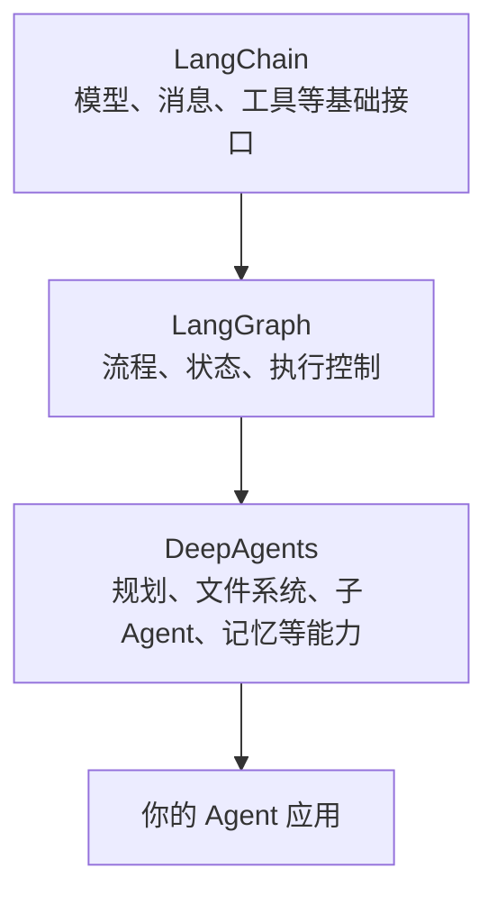

# LangChain、LangGraph 和 DeepAgents 是什么关系

## 这一节你会学到什么

你会知道三个名字分别是什么：

- LangChain
- LangGraph
- DeepAgents

这能帮你看官方文档时不迷路。

## 一句话讲清楚

LangChain 提供基础零件，LangGraph 负责流程和状态，DeepAgents 帮你快速组装一个更完整的 Agent。

## 用一个简单例子理解

继续用“电脑里的人”来理解。

如果 Agent 是一个住在电脑里、能帮你做事的人，那么：

- LangChain 提供他的基础零件，比如脑子接口、消息格式、工具接口。
- LangGraph 管理他的工作流程，比如先做什么、后做什么、当前任务状态是什么。
- DeepAgents 是一个已经配好常用能力的高级助手模板。

## 回到 DeepAgent

DeepAgents 不是凭空出现的。它建立在 LangChain 和 LangGraph 之上。



## 为什么小白需要知道这个关系

因为官方文档里会经常出现这些名字。

如果你不知道它们的层次关系，就容易以为自己要同时学完三个框架才能开始。

实际上，入门阶段可以这样理解：

> 我们先使用 DeepAgents 快速做出一个能运行的 Agent。  
> 等需要更深定制时，再逐步理解 LangGraph 和 LangChain。

## 常见误解

### 误解 1：必须先学完 LangChain 才能学 DeepAgents

不需要。

你可以先用 DeepAgents 跑起来，再慢慢补 LangChain 的基础概念。

### 误解 2：LangGraph 是画图工具

不是。

LangGraph 里的 graph 更接近“任务流程图”和“状态流转系统”。它负责让 Agent 的执行过程更可控。

### 误解 3：DeepAgents 只是一个更大的 prompt

不是。

DeepAgents 不只是写了一段提示词。它还提供了规划、文件系统、子 Agent、记忆、安全控制等能力。

## 小结

先记住这个关系：

```text
LangChain：基础零件
LangGraph：流程和状态
DeepAgents：高级 Agent 套件
```

下一门课，我们会开始准备环境，并跑通第一个最小 Agent。
