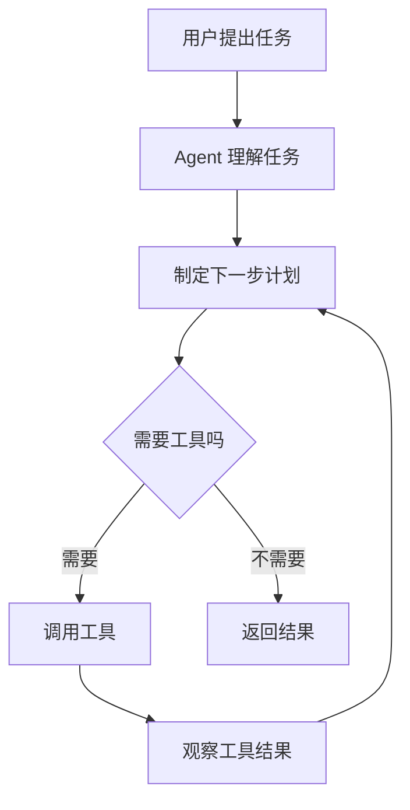

# 什么是 Agent

## 这一节你会学到什么

你会先建立一个最重要的直觉：

> Agent 可以理解成一个住在电脑里的“人”。

这个说法不是严格定义，但对小白很有用。

## 一句话讲清楚

Agent 是一个由大模型驱动、可以根据任务思考、使用工具并执行步骤的软件助手。

## 用一个简单例子理解

普通聊天机器人更像一个只会说话的人。

你问它：

```text
帮我制定一个 7 天学习 DeepAgent 的计划。
```

它可以直接回答你一段文字。

但 Agent 不只是说话。它更像一个在电脑里帮你做事的人。它可以：

- 先问你有没有 Python 基础。
- 根据你的时间安排拆解学习路径。
- 把计划写进文件。
- 搜索资料。
- 根据你的反馈修改计划。

## 回到 Agent

所以学习 Agent 时，我们关心的不是“它能不能聊天”，而是它怎么完成任务：



## 代码里长什么样

后面你会看到类似这样的代码：

```python
from deepagents import create_deep_agent

agent = create_deep_agent(
    model="...",
    tools=[],
    system_prompt="你是一个耐心的新手教练。"
)

result = agent.invoke({
    "messages": [
        {"role": "user", "content": "帮我制定一个 7 天学习 DeepAgent 的计划"}
    ]
})
```

现在不需要完全看懂。你只需要先知道：

- `model` 是这个“电脑里的人”的脑子。
- `tools` 是他能用的工具。
- `system_prompt` 是你给他的身份和工作规则。
- `messages` 是你和他的聊天记录。

## 常见误解

### Agent 不是魔法

Agent 不是真的人，也不会凭空知道一切。

它能做什么，取决于：

- 模型能力。
- 你给它的指令。
- 你提供的工具。
- 它能看到的上下文。
- 你允许它执行的操作。

### Agent 不等于大模型

大模型更像脑子。

Agent 是把脑子、工具、记忆、规则和执行流程组合起来的软件系统。

## 小结

先记住一句话：

> Agent 是一个住在电脑里的任务执行者。

下一节，我们会看清楚 LangChain、LangGraph 和 DeepAgents 分别在这个系统里负责什么。
