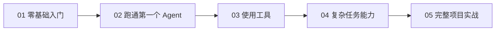

# 课程总览

Agent4all 会分成 5 门课程。

目标不是把官方文档翻译一遍，而是把 DeepAgent 的学习路径重新整理成小白能跟着走的顺序。

## 课程路线

## 01. DeepAgent 零基础入门

先建立认知地图。

你会理解 Agent 是什么，为什么它不只是聊天机器人，以及 LangChain、LangGraph 和 DeepAgents 分别负责什么。

[进入课程](/courses/01-basics/)

## 02. 从 0 跑通第一个 Agent

从环境准备开始，带你跑通第一个最小 DeepAgent。

[进入课程](/courses/02-first-agent/)

## 03. 让 Agent 会使用工具

理解工具调用，让 Agent 从“会说话”变成“会做事”。

[进入课程](/courses/03-tools/)

## 04. 让 Agent 能完成复杂任务

学习规划、文件系统、上下文管理、记忆和子 Agent。

[进入课程](/courses/04-deep-capabilities/)

## 05. 安全、调试与完整项目实战

补齐权限、安全、人工确认、调试和最终项目。

[进入课程](/courses/05-project/)
