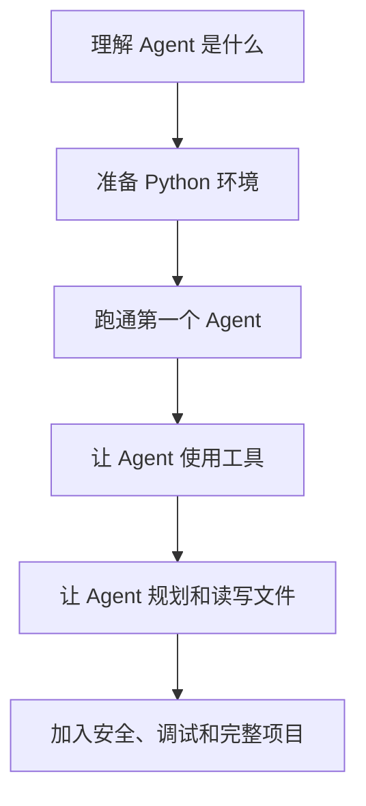

## 学习路线

## 我们怎么解释 Agent

Agent 可以先理解成一个住在电脑里的“人”。

它不是真的人，而是一个由大模型驱动、可以根据指令思考、使用工具、执行任务的软件助手。

学习 Agent 的关键，不是背概念，而是理解这个“电脑里的人”：

- 他的脑子是什么。
- 你怎么给他任务。
- 他能看到什么信息。
- 他能使用什么工具。
- 他被允许做什么。
- 他如何一步一步完成任务。

## 课程安排

从 [课程总览](/courses/) 开始。
